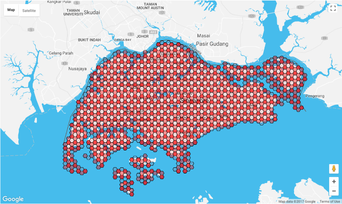
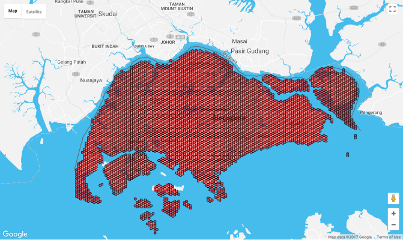
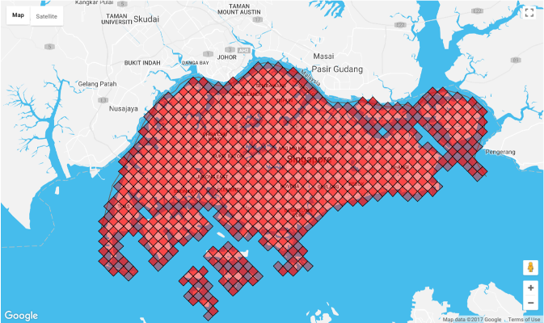
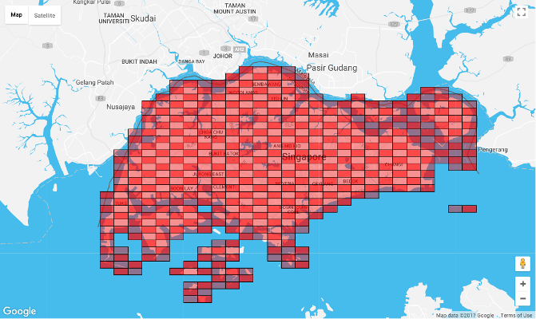

# hextile
Generate tile representations of polygon objects on map



### Usage
```javascript
import hextile from 'hextile'

hextile(geojson, options)
```

Refer to IETF's [RFC7946](https://tools.ietf.org/html/rfc7946) for accepted format of geojson input.

### Options

```javascript
/**
 * @param {('square'|'hexagon')} options.shape - default 'square'
 * @param {number} options.width - in metre, default 1000, min 500, max 500000
 * @param {number} options.tilt - in deg, default 0
 * @param {[number, number]} options.center - [lon, lat] of grid origin
 * @param {Object} options.projection - object exposing two methods 'forward' & 'inverse'
 * @param {Function} options.projection.forward - map lonlat to grid coordinates
 * @param {Function} options.projection.inverse - map grid coordinates to lonlat
 */
```

#### options.shape
```javascript
hextile(geojson, {shape: 'square'})
```


#### options.width
```javascript
hextile(geojson, {shape: 'hexagon', width: 500})
hextile(geojson, {shape: 'hexagon', width: 2000})
```


#### options.tilt
```javascript
hextile(geojson, {shape: 'square', tilt: 45})
hextile(geojson, {shape: 'hexagon', tilt: 90})
```


#### options.center
```javascript
// used when projecting lonlat to grid coordinates
// by default is set to center of geojson's bbox
// here we choose a latitude far away from equator
// to illustrate the distortion due to Earth's spherical nature
hextile(geojson, {shape: 'square', width: 1000, center: [103.8, 60]})
```


#### options.projection
By default, we use [equirectangular projection](https://en.wikipedia.org/wiki/Equirectangular_projection) (also called the equidistant cylindrical projection) for conversion between lonlat and grid coordinates based on the **width** and **center** supplied by **options**. When area is large and covers a wide range of latitudes (eg. the Africa continent), this projection method may not be ideal. Hence we provide an option to overwrite the default projection method.

**projection** object should exposes two methods **forward** and **inverse** (similar to [Proj4js](http://proj4js.org/)) which will be used internally by the **hextile** function for conversion between lonlat and grid coordinates.

### Output
Output is an array of geojson features each representing one grid tile.

Eg.
```json
[
  {
    "id": "0.0",
		"type": "Feature",
		"properties": {
			"address": [0,0],
			"center": [103.8470918851487,1.3147367663544147]
		},
		"geometry": {
			"type": "Polygon",
			"coordinates": [
				[
					[103.85158967726275,1.3147367663544147],
					[103.84934078120573,1.3186309431389038],
					[103.84484298909167,1.3186309431389038],
					[103.84259409303465,1.3147367663544147],
					[103.84484298909167,1.3108425895699256],
					[103.84934078120573,1.3108425895699256],
					[103.85158967726275,1.3147367663544147]
				]
			]
		}
	},
	{
		"id": "M1.M2",
		"type": "Feature",
		"properties": {
			"address": [-1,-2],
			"center": [103.84034519697764,1.3186309431389038]
		},
		"geometry": {
			"type": "Polygon",
			"coordinates": [
				[
					[103.84484298909167,1.3186309431389038],
					[103.84259409303465,1.3225251199233932],
					[103.83809630092061,1.3225251199233932],
					[103.83584740486359,1.3186309431389038],
					[103.83809630092061,1.3147367663544147],
					[103.84259409303465,1.3147367663544147],
					[103.84484298909167,1.3186309431389038]
				]
			]
		}
	}
]
```

### CLI
```
> hextile -h

Usage: hextile [options] <infile> <outfile>

Generate tile representations of polygon objects on map

Options:

  -h, --help                        output usage information
  -s --shape <shape>                square or hexagon tile
  -w --width <metre>                set tile width
  -t --tilt <deg>                   rotate tile
  -c --center <longitude,latitude>  center map at
```
